# 📘 Front-door Automation — Home Assistant Blueprint  


Automated front‑door logic with person detection, doorbell logic, and sunset‑aware lighting.

This Home Assistant blueprint provides an advanced automation for handling three common front‑door scenarios:

1. **The door opens and a person is detected near the door**  
   → 🏠 **Option 1 – Coming Home**

2. **The door opens without a person detected**  
   → 🚶‍♂️ **Option 2 – Leaving Home**

3. **The door opens shortly after the doorbell was pressed**  
   → 🔔 **Option 3 – Visitor Arriving**

The blueprint is fully configurable, supports sunset‑based lighting, and includes adjustable time windows for all detection logic.

---

> [!CAUTION]
> This blueprint is **NOT TESTED YET**.  
> Use at your own discretion and verify behavior in your Home Assistant environment before relying on it.

---

## 🧭 Flow Diagram

```mermaid
flowchart TD

A[🚪 Front door opens] --> B{🧍 Was a person detected recently?}

%% Person detected path -> Option 1 or 3
B -->|Yes| C{🔔 Was the doorbell pressed recently?}

%% Option 1 – Coming Home
C -->|No| O1_START[🏠 Option 1 – Coming Home]
O1_START --> O1_HALL_ON[💡 Turn on hallway light]

%% Option 3 – Visitor Arriving
C -->|Yes| O3_START[🔔 Option 3 – Visitor Arriving]

%% Option 3 - Visitor Arriving path
O3_START --> O3_HALL_ON[💡 Turn on hallway light]
O3_HALL_ON --> O3_SUN{🌙 Is it after sunset?}
O3_SUN -->|Yes| O3_GARDEN_ON[💡 Turn on garden light]
O3_SUN -->|No| O3_SKIP_GARDEN[➡️ Skip garden light]
O3_GARDEN_ON --> O3_WAIT_CLOSE[⏳ Wait for door to close]
O3_SKIP_GARDEN --> O3_WAIT_CLOSE
O3_WAIT_CLOSE --> O3_WAIT_DELAY[⏳ Wait configured delay]
O3_WAIT_DELAY --> O3_GARDEN_OFF[💡 Turn off garden light]

%% No person path -> Option 2 only
B -->|No| O2_START[🚶‍♂️ Option 2 – Leaving Home]

%% Option 2 - Leaving Home path
O2_START --> O2_SUN{🌙 Is it after sunset?}
O2_SUN -->|Yes| O2_GARDEN_ON[💡 Turn on garden light]
O2_SUN -->|No| O2_SKIP_GARDEN[➡️ Skip garden light]
O2_GARDEN_ON --> O2_WAIT_DELAY[⏳ Wait configured delay]
O2_SKIP_GARDEN --> O2_WAIT_DELAY
O2_WAIT_DELAY --> O2_HALL_OFF[💡 Turn off hallway light]
O2_HALL_OFF --> O2_GARDEN_OFF[💡 Turn off garden light]

%% =========================
%% HOME ASSISTANT–THEMED COLORS
%% =========================

classDef option1 fill:#E8F5E9,stroke:#4CAF50,stroke-width:2px,color:#1B5E20;
classDef option2 fill:#E3F6FF,stroke:#41BDF5,stroke-width:2px,color:#0A3D62;
classDef option3 fill:#FFF1E6,stroke:#FF8C2F,stroke-width:2px,color:#8C3A00;

class O1_START,O1_HALL_ON option1;
class O2_START,O2_GARDEN_ON,O2_SKIP_GARDEN,O2_WAIT_DELAY,O2_HALL_OFF,O2_GARDEN_OFF option2;
class O3_START,O3_HALL_ON,O3_GARDEN_ON,O3_SKIP_GARDEN,O3_WAIT_CLOSE,O3_WAIT_DELAY,O3_GARDEN_OFF option3;

```


---

## ✨ Features

### ✔ Smart detection logic  
The automation reacts differently depending on:

- Whether a person was detected recently  
- Whether the doorbell was pressed recently  
- Whether it is after sunset  
- Whether the door is opened or closed  

### ✔ Three fully automated scenarios  

#### **Option 1 — Person detected recently (no doorbell)**  
Triggered when the front door opens **and**:

- A person was detected within the last *X* seconds  
- The doorbell was **not** pressed within the last *Y* seconds  

**Action:**  
Turn on the hallway light.

---

#### **Option 2 — No person detected**  
Triggered when the front door opens **and** no person was detected.

**Actions:**

- Turn on the garden/front‑yard light **only after sunset**  
- Wait *Z* seconds  
- Turn off hallway light  
- Turn off garden light (even if it never turned on)

---

#### **Option 3 — Doorbell pressed recently**  
Triggered when the front door opens **and** the doorbell was pressed within the last *N* seconds.

**Actions:**

- Turn on hallway light  
- Turn on garden light **only after sunset**  
- Wait until the door closes  
- Wait *Z* seconds  
- Turn off garden light  

---

## 🛠️ Inputs & Configuration

### **Required entities**
| Input | Description |
|-------|-------------|
| `voordeur_sensor` | Binary sensor for the front door |
| `deurbel_sensor` | Binary sensor for the doorbell |
| `persoon_sensor` | Binary sensor for person detection |
| `licht_hal` | Hallway light |
| `licht_voortuin` | Garden/front‑yard light |

---

### **Configurable time windows**
| Input | Default | Purpose |
|-------|---------|---------|
| `persoon_window` | 30s | Person detection window for Option 1 |
| `deurbel_not_window` | 30s | Doorbell must *not* be pressed within this window for Option 1 |
| `deurbel_window` | 60s | Doorbell must be pressed within this window for Option 3 |
| `delay_window` | 30s | Delay before turning lights off in Options 2 & 3 |

---

## 🌅 Sunset‑aware lighting

The garden/front‑yard light (`licht_voortuin`) only turns on **after sunset**.  
This is handled using:

```
sun.sun == below_horizon
```

Even during daytime, the automation still performs all other actions (like turning lights off).

---

## 📦 Installation

1. Copy the blueprint YAML file into:  
   ```
   config/blueprints/automation/<yourname>/voordeur_automatisering.yaml
   ```
2. Restart Home Assistant or reload automations.
3. Go to:  
   **Settings → Automations & Scenes → Blueprints → Create Automation**
4. Select **Voordeur Automatisering (Persoon / Geen Pers
